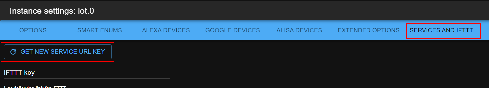

# ioBroker IoT Adapter


[](https://www.npmjs.com/package/iobroker.iot)


[](https://weblate.iobroker.net/engage/adapters/?utm_source=widget)
[](https://www.npmjs.com/package/iobroker.iot)

This adapter is ONLY for communication with Amazon Alexa, Google Home and Nightscout.
It is not for remote access to your ioBroker instance. Use ioBroker.cloud adapter for that.

**This adapter uses Sentry libraries to automatically report exceptions and code errors to the developers.** For more details and for information how to disable the error reporting see [Sentry-Plugin Documentation](https://github.com/ioBroker/plugin-sentry#plugin-sentry)! Sentry reporting is used starting with js-controller 3.0.

## Settings

To use the iot adapter, you should first register on the ioBroker cloud [https://iobroker.pro](https://iobroker.pro).

Note: Humidity sensor cannot be shown alone without temperature sensor, because Alexa and Google Home do not support such devices.

[Reference to google API type settings](https://developers.google.com/actions/smarthome/guides/)


### Language

If you select "default" language, the smart names of devices and of enumerations will not be translated. If some language is specified, all known names will be translated into this language.
It is done to switch fast between many languages for demonstration purposes.

### Place function in names first

Change the order of function and roles in self-generated names:

-   if false: "Room function", e.g. "Living room dimmer"
-   if true: "Function room", e.g. "Dimmer living room"

### Concatenate words with

You can define the word which will be placed between function and room. E.g. "in" and from "Dimmer living room" will be "Dimmer in living room".

But it is not suggested doing so, because recognition engine must analyze one more word, and it can lead to misunderstandings.

### OFF level for switches

Some groups consist of mixed devices: dimmers and switches. It is allowed to control them with "ON" and "OFF" commands and with percents.
If command is `Set to 30%` and the `OFF level is 30%` so the switches will be turned on. By command "Set to 25%" all switches will be turned OFF.

Additionally, if the command is "OFF", so the adapter will remember the current dimmer level if the actual value is over or equal to the "30%".
Later when the new "ON" command comes, the adapter will switch the dimmer not to 100% but to the level in memory.

Example:

-   Assume, that _OFF level_ is 30%.
-   Virtual device "Light" has two physical devices: _switch_ and _dimmer_.
-   Command: "set the light to 40%". The adapter will remember this value for _dimmer_, will set it for "dimmer" and will turn the _switch_ ON.
-   Command: "turn the light off". The adapter will set the _dimmer_ to 0% and will turn off the _switch_.
-   Command: "turn on the light". _dimmer_ => 40%, _switch_ => ON.
-   Command: "set the light to 20%". _dimmer_ => 20%, _switch_ => OFF. The value for dimmer will not be remembered, because it is bellow _OFF level_.
-   Command: "turn on the light". _dimmer_ => 40%, _switch_ => ON.

### by ON

You can select the behavior of ON command will come for the number state. The specific value can be selected, or the last non-zero value will be used.

### Write response to

For every command, the text response will be generated. You can define here the Object ID, where this text must be written to. E.g. _sayit.0.tts.text_.

### Colors

The channel needs 3-5 states with the following roles:

-   `level.color.saturation` - required for detection of the channel,
-   `level.color.hue`,
-   `level.dimmer`,
-   `switch` - optional,
-   `level.color.temperature` (optional)

```
Alexa, set the "device name" to "color"
Alexa, turn the light fuchsia
Alexa, set the bedroom light to red
Alexa, change the kitchen to the color chocolate
```

### Lock

To have the possibility to lock the locks, the state must have the role `switch.lock` and have `native.LOCK_VALUE` to determine the lock state.
If you need a separate Value to control the Lock, you can use `native.CONTROL VALUE`.

```
Alexa, is "lock name" locked/unlocked
Alexa, lock the "lock name"
```

## How names will be generated

The adapter tries to generate virtual devices for smart home control (e.g., Amazon Alexa or Google Home).

There are two important enumerations for that: rooms and functions.

Rooms are like: living room, bathroom, sleeping room.
Functions are like: light, blind, heating.

The following conditions must be met to get the state in the automatically generated list:

-   the state must be in some `function` enumeration.
-   the state must have a role (`state`, `switch` or `level.\*`, e.g., `level.dimmer`) if not directly included in "functions".
    It can be that the channel is in the `functions`, but state itself not.
-   the state must be writable: `common.write` = true
-   the state dimmer must have `common.type` as 'number'
-   the state heating must have `common.unit` as `°C`, `°F` or `°K` and `common.type` as `number`

If the state is only in "functions" and not in any "room", the name of state will be used.

The state names will be generated from function and room. E.g., all _lights_ in the _living room_ will be collected in the virtual device _living room light_.
The user cannot change this name, because it is generated automatically.
But if the enumeration name changes, this name will be changed too. (e.g., function "light" changed to "lights", so the _living room light_ will be changed to _living room lights_)

All the rules will be ignored if the state has common.smartName. In this case, just the smart name will be used.

if `common.smartName` is `false`, the state or enumeration will not be included in the list generation.

The configuration dialog lets the comfortable remove and add the single states to virtual groups or as single device.


If the group has only one state, it can be renamed, as for this the state's smartName will be used.
If the group has more than one state, the group must be renamed via the enumeration's names.

To create own groups, the user can install "scenes" adapter or create "script" in JavaScript adapter.

### Replaces

You can specify strings that could be automatically replaced in the device names. E.g., if you set replaces to:
`.STATE,.LEVEL`, so all `.STATE` and `.LEVEL` will be deleted from names. Be careful with spaces.
If you set `.STATE, .LEVEL`, so `.STATE` and `.LEVEL` will be replaced and not `.LEVEL`.

## Helper states

-   `smart.lastObjectID`: This state will be set if only one device was controlled by home skill (alexa, google home).
-   `smart.lastFunction`: Function name (if exists) for which last command was executed.
-   `smart.lastRoom`: Room name (if exists) for which last command was executed.
-   `smart.lastCommand`: Last executed command. Command can be: `true(ON)`, `false(OFF)`, `number(%)`, `-X(decrease at x)`, `+X(increase at X)`
-   `smart.lastResponse`: Textual response on command. It can be sent to some `text2speech` (`sayit`) engine.

## Toggle mode

Alexa v3 supports toggle mode.
It means that if you say "Alexa, turn on the light" and the light is already on, it will be turned off.

## IFTTT

[instructions](doc/ifttt.md)

## Google Home

If you see the following error message in the log: `[GHOME] Invalid URL Pro key. Status auto-update is disabled you can set states but receive states only manually`.
So you must generate the URL-Key anew:



## Services

There is a possibility to send messages to cloud adapter.
If you call `[POST]https://service.iobroker.in/v1/iotService?service=custom_<NAME>&key=<XXX>&user=<USER_EMAIL>` und value as payload.

`curl --data "myString" https://service.iobroker.in/v1/iotService?service=custom_<NAME>&key=<XXX>&user=<USER_EMAIL>`

or

`[GET]https://service.iobroker.in/v1/iotService?service=custom_<NAME>&key=<XXX>&user=<USER_EMAIL>&data=myString`

If you set in the settings the field teh "White list for services" the name `custom_test`, and call with "custom_test" as the service name, the state **cloud.0.services.custom_test** will be set to _myString_.

You may write "\*" in the white list and all services will be allowed.

Here you can find instructions on how to use it with [tasker](doc/tasker.md).

IFTTT service is allowed only if an IFTTT key is set.

Reserved names are `ifttt`, `text2command`, `simpleApi`, `swagger`. These must be used without the `custom_` prefix.

You can ask by message the valid URL for service too:

```js
sendTo('iot.0', 'getServiceEndpoint', { serviceName: 'custom_myService' }, result =>
    console.log(JSON.stringify(result)),
);
// Output: {"result":
//  {"url": "https://service.iobroker.in/v1/iotService?key=xxx&user=uuu&service=custom_myService",
//   "stateID":"iot.0.services.myService",
//   "warning":"Service name is not in white list"
//  }}
```

### `text2command`

You may write `text2command` in white list, you can send POST request to `https://service.iobroker.in/v1/iotService?service=text2command&key=<user-app-key>&user=<USER_EMAIL>` to write data into _text2command.X.text_ variable.

You can use GET method too `https://service.iobroker.in/v1/iotService?service=text2command&key=<user-app-key>&user=<USER_EMAIL>&data=<MY COMMAND>`

`X` can be defined in settings by the "Use text2command instance" option.

## Custom skill

The answers for the custom skill can be processed in two ways:

-   `text2command`
-   `javascript`

### `text2command`

if `text2command` instance is defined in the configuration dialog, so the question will be sent to the instance.

`text2command` must be configured that the expected phrase will be parsed and the answer will be given back.

### `Javascript`

There is a possibility to process the question directly with the script. It is activated by default if no `text2command` instance is selected.

If `text2command` instance is defined, so this instance must provide the answer and the answer from _script_ will be ignored.

The adapter will provide the details in two states with different detail level

-   `smart.lastCommand` contains the received text including info about the type of query (intent). Example: `askDevice Status Rasenmäher`
-   `smart.lastCommandObj` contains an JSON string that can be parsed to an object containing the following information
    -   `words` contain the received words in an array
    -   `intent` contains the type of query. Possible values currently are:
        -   v1 Skill: `askDevice`, `controlDevice`, `actionStart`, `actionEnd`, `askWhen`, `askWhere`, `askWho`
        -   v2 Skill: `queryIntent` when the full said text was captured, `controlDevice` for fallback with only partial text
    -   `deviceId` contains a deviceId identifying the device the request was sent to, delivered by Amazon, will be empty string if not provided
    -   `deviceRoom` contains a mapped room identifier you can configure in iot admin UI for collected deviceIds
    -   `sessionId` contains a sessionId of the Skill session, should be the same if multiple commands were spoken, delivered by Amazon, will be empty string if not provided
    -   `userId` contains a userId from the device owner (or maybe later the user that was interacting with the skill), delivered by Amazon, will be empty string if not provided
    -   `userName` contains a mapped username you can configure in iot admin UI for collected userIds

More details on how the words are detected and what type of queries the Alexa Custom Skill differentiates, please check https://forum.iobroker.net/viewtopic.php?f=37&t=17452 .

**Return result via smart.lastResponse state**

The response needs to be sent within 200ms in the state `smart.lastResponse`, and can be a simple text string or a JSON object.
If it is a text string, then this text will be sent as a response to the skill.
If the text is a JSON object, then the following keys can be used:

-   `responseText` needs to contain the text to return to Amazon
-   `shouldEndSession` is a boolean and controls if the session is closed after the response was spoken or stays open to accept another voice input.
-   `sessionId` needs to contain the sessionId the response is meant for. Ideally, provide it to allow concurrent sessions. If not provided, the first session that expects a response is assumed.

**Return result via the message to iot instance**

The iot instance also accepts a message with the name "alexaCustomResponse" containing the key "response" with an object that can contain the keys `responseText` and `shouldEndSession` and `sessionId` as described above.
There will be no response from the iot instance to the message!

**Example of a script that uses texts**

```js
// important, that ack=true
on({ id: 'iot.0.smart.lastCommand', ack: true, change: 'any' }, obj => {
    // you have 200ms to prepare the answer and to write it into iot.X.smart.lastResponse
    setState('iot.0.smart.lastResponse', 'Received phrase is: ' + obj.state.val); // important, that ack=false (default)
});
```

**Example of a script that uses JSON objects**

```js
// important, that ack=true
on({ id: 'iot.0.smart.lastCommandObj', ack: true, change: 'any' }, obj => {
    // you have 200ms to prepare the answer and to write it into iot.X.smart.lastResponse
    const request = JSON.parse(obj.state.val);
    const response = {
        responseText: 'Received phrase is: ' + request.words.join(' ') + '. Bye',
        shouldEndSession: true,
        sessionId: request.sessionId,
    };

    // Return response via state
    setState('iot.0.smart.lastResponse', JSON.stringify(response)); // important, that ack=false (default)

    // or alternatively return as message
    sendTo('iot.0', 'alexaCustomResponse', response);
});
```

### Private cloud

If you use private skill/action/навык for communication with `Alexa/Google Home/Алиса` so you have the possibility to use IoT instance to process the requests from it.

E.g. for `yandex alice`:

```js
const OBJECT_FROM_ALISA_SERVICE = {}; // object from alisa service or empty object
OBJECT_FROM_ALISA_SERVICE.alisa = '/path/v1.0/user/devices'; // called URL, 'path' could be any text, but it must be there
sendTo('iot.0', 'private', { type: 'alisa', request: OBJECT_FROM_ALISA_SERVICE }, response => {
    // Send this response back to alisa service
    console.log(JSON.stringify(response));
});
```

The following types are supported:

-   `alexa` - acting with Amazon Alexa or Amazon Custom Skill
-   `ghome` - acting with Google Actions via Google Home
-   `alisa` - acting with Yandex Алиса
-   `ifttt` - acting like IFTTT (actually not required, but for tests purposes)

## Yandex Алиса

[instructions](doc/alisa.md)

## Send messages to app

From version 1.15.x you can send messages to `ioBroker Visu` application ([Android](https://play.google.com/store/apps/details?id=com.iobroker.visu) and [iOS](https://apps.apple.com/de/app/iobroker-visu/id1673095774)).
For that, you need to write the following states:

```js
setState('iot.0.app.expire', 60); // optional. Time in seconds
setState('iot.0.app.priority', 'normal'); // optional. Priority: 'high' or 'normal'
setState('iot.0.app.title', 'ioBroker'); // optional. Default "ioBroker"
setState('iot.0.app.message', 'Message text'); // important, that ack=false (default)

// or just one state (this also allows to use payload -> `actions`, `devices` and `link` property)
// only message is mandatory. All other are optional
// Note that, if you are using `actions`or `devices`, the app needs to handle the notification in the background before showing it
// in some scenarios, e.g. low power or spamming to many notifications the OS may decide to not show the notification at all
setState('iot.0.app.message', JSON.stringify({
  message: 'Message text',
  title: 'ioBroker',
  expire: 60,
  priority: 'normal', 
  payload: {
      devices: JSON.stringify(['iPhone von Maelle', 'iPhone von Max']), // devices to send the message to, if not given send to all - requires Visu App 1.4.0
      openUrl: 'https://www.iobroker.net', // opens a link when clicking on the notification
      actions: JSON.stringify([ // actions to respond to the notification - requires Visu App 1.4.0
          { buttonTitle: 'Yes', identifier: 'home:yes' }, // The app will display the button title and on clicking the identifier will be set to the state `iot.0.app.devices.<deviceName>.actionResponse`
          { buttonTitle: 'No', identifier: 'home:no' }
      ])
  }
})); // important, that ack=false (default)
```

## Todo

-   Smart names must have higher priority as groups
-   Devices should be grouped by smart name

<!--
	Placeholder for the next version (at the beginning of the line):
	### **WORK IN PROGRESS**
-->
## Changelog
### **WORK IN PROGRESS**
- (@GermanBluefox) Added possibility to group devices by type in GUI
- (@GermanBluefox) Allowed to select any type in Alexe V3

### 5.0.6 (2025-11-01)
- (@GermanBluefox) Added logs to detect the issues with detection
- (@GermanBluefox) Added possibility to use the 0/1 state as socket
- (@GermanBluefox) Added dialog to bulk manage the smart names of one device

### 5.0.5 (2025-10-31)
- (@GermanBluefox) Changed behavior of HUE lamps

### 5.0.2 (2025-10-30)
- (@GermanBluefox) Added mireds<->kelvin conversion for color temperature
- (@GermanBluefox) It is possible to edit a type
- (@GermanBluefox) Correcting creation of complex groups
- (@GermanBluefox) Same as 4.2.11

### 4.2.9 (2025-10-28)
- (@GermanBluefox) Do not control "white" by RGBW devices
- (@GermanBluefox) Corrected GUI error
- (@GermanBluefox) Avoid double entries in auto-detection

### 4.2.7 (2025-10-26)
- (@GermanBluefox) Create the service states at the instance start
- (@GermanBluefox) Corrected error with gates

## License

The MIT License (MIT)

Copyright (c) 2018-2025 bluefox <dogafox@gmail.com>

Permission is hereby granted, free of charge, to any person obtaining a copy
of this software and associated documentation files (the "Software"), to deal
in the Software without restriction, including without limitation the rights
to use, copy, modify, merge, publish, distribute, sublicense, and/or sell
copies of the Software, and to permit persons to whom the Software is
furnished to do so, subject to the following conditions:

The above copyright notice and this permission notice shall be included in all
copies or substantial portions of the Software.

THE SOFTWARE IS PROVIDED "AS IS", WITHOUT WARRANTY OF ANY KIND, EXPRESS OR
IMPLIED, INCLUDING BUT NOT LIMITED TO THE WARRANTIES OF MERCHANTABILITY,
FITNESS FOR A PARTICULAR PURPOSE AND NONINFRINGEMENT. IN NO EVENT SHALL THE
AUTHORS OR COPYRIGHT HOLDERS BE LIABLE FOR ANY CLAIM, DAMAGES OR OTHER
LIABILITY, WHETHER IN AN ACTION OF CONTRACT, TORT OR OTHERWISE, ARISING FROM,
OUT OF OR IN CONNECTION WITH THE SOFTWARE OR THE USE OR OTHER DEALINGS IN THE
SOFTWARE.
