# How to use IFTTT

You can use IFTTT service with ioBroker. Below you can find how to configure data flow from ioBroker to IFTTT and back.

For that the IFTTT "Maker Webhook" service will be used. 

## Example 1

We will create following rule: 
ioBroker => IFTTT => Maker Webhook => Telegram

### Create new applet
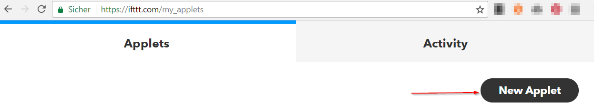

### Click +this


### Find Maker webhooks
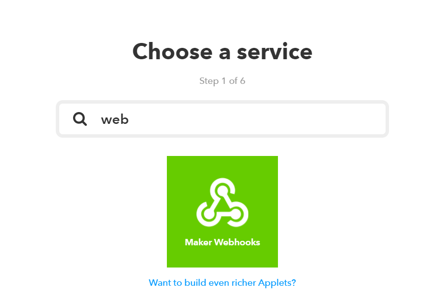

### Choose trigger
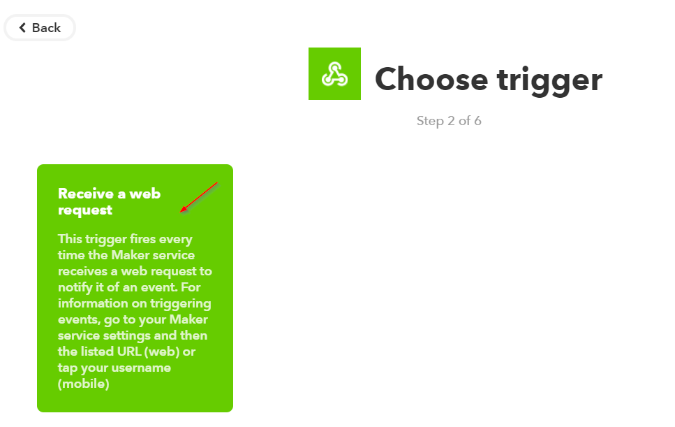

### Define event name
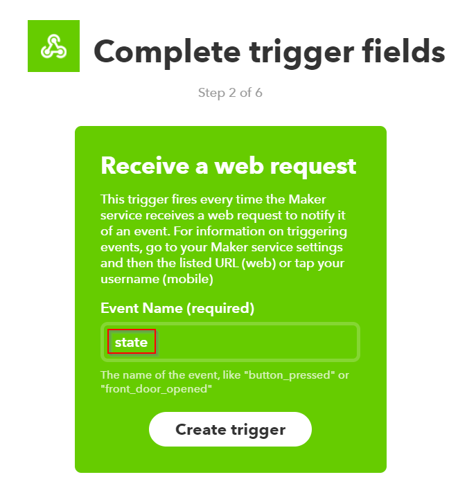
Use the same event name as you will use in blockly.

### Find action Telegram
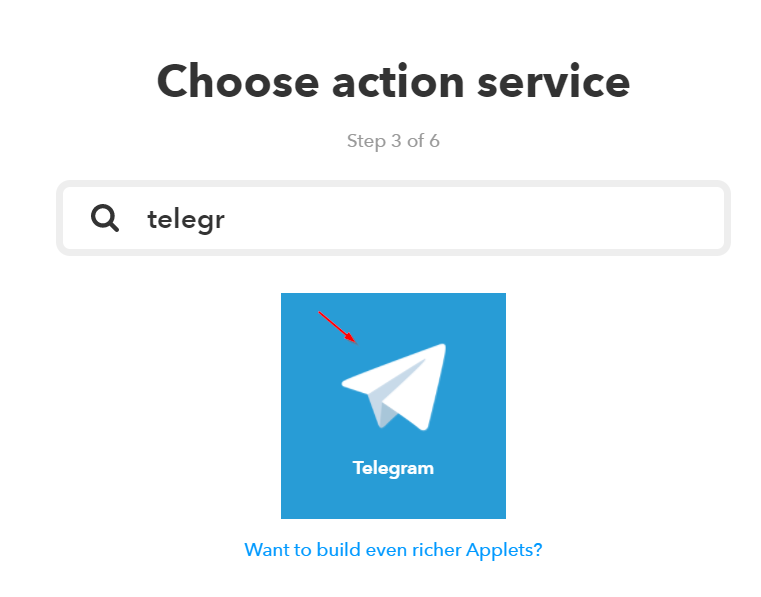

### Choose action
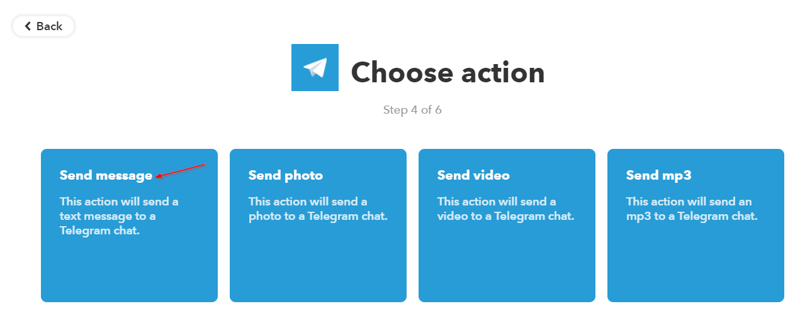

### Format message text
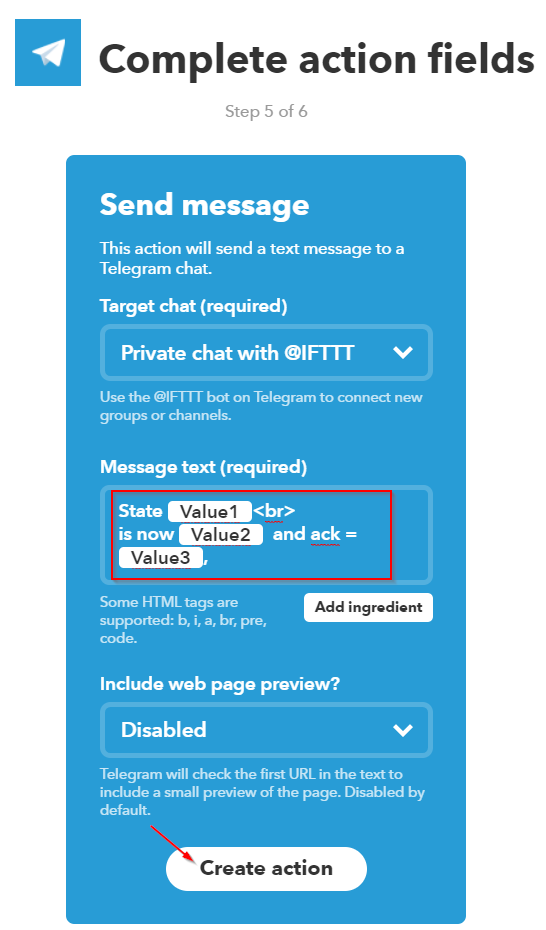

- Value1 is Object ID
- Value2 is value of the state
- Value3 is ack (true/false)

### Finish
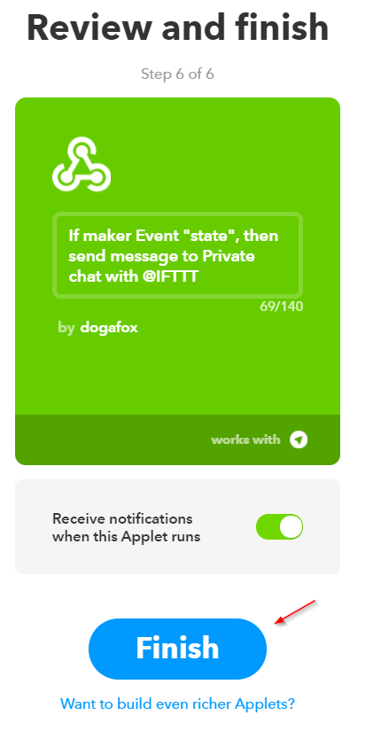

### Get the key
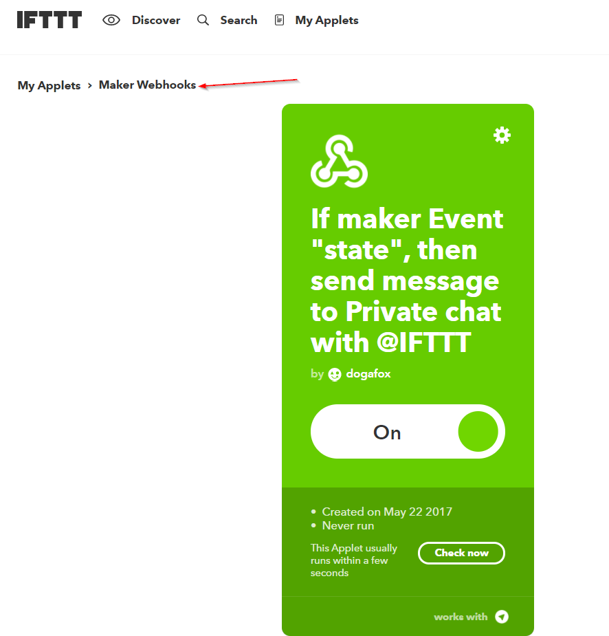

### Copy key
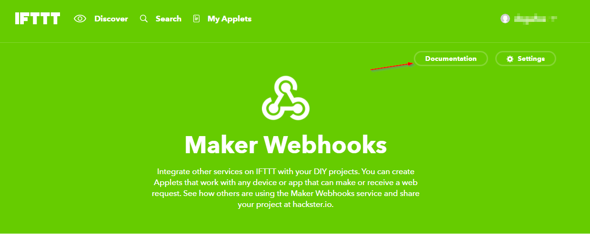

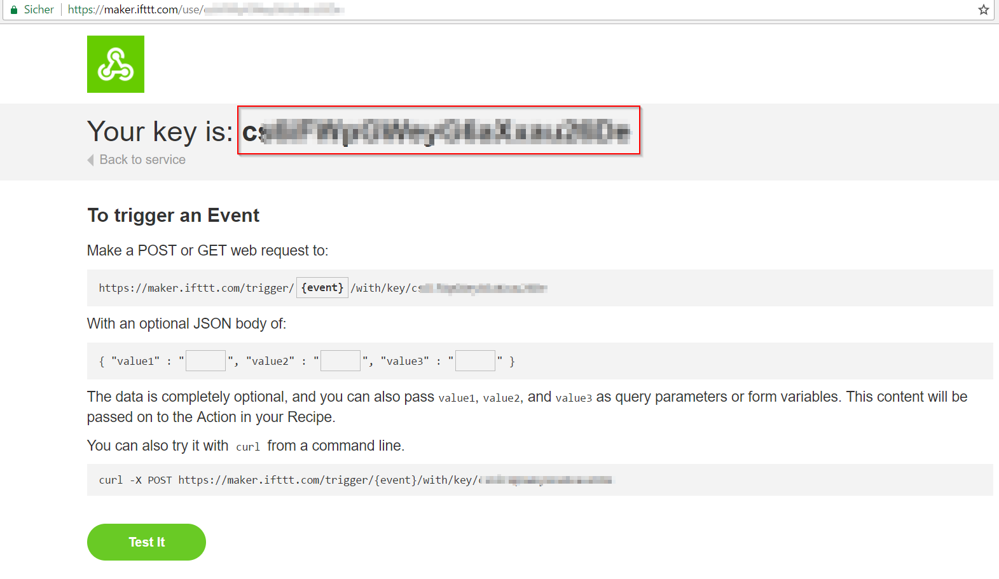

and paste it into config

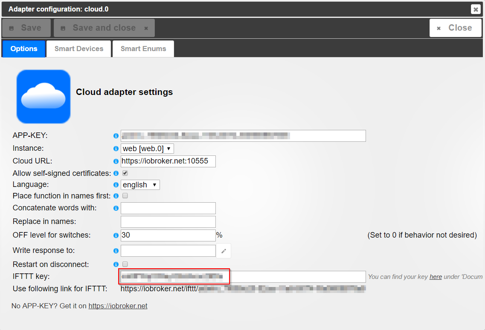

now you can use even blockly to send the text to IFTTT.
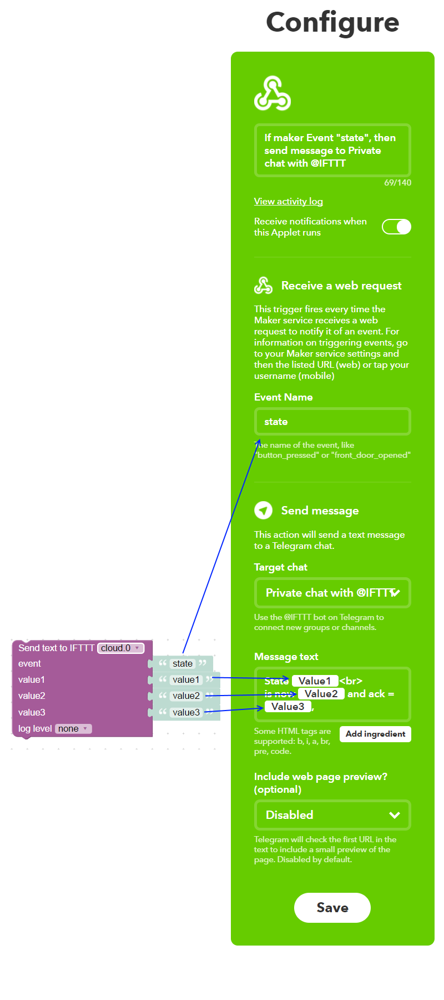

you can send via script with

```
sendTo("cloud.0", "ifttt", {
    event: 'state', 
    value1: 'value1', 
    value2: 'value2', 
    value3: 'value3'
});
```

If no "id" is defined, it will be used: "cloud.0.service.ifttt". Ack is optional.

You can set the variable "cloud.0.service.ifttt" with some value and the text will be sent too.

## Example 2

Telegram => IFTTT => Maker Webhook => ioBroker

Example how to send some text via telegram to ioBroker.


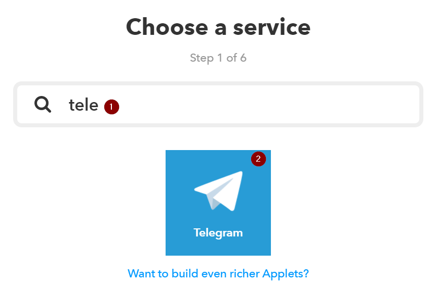

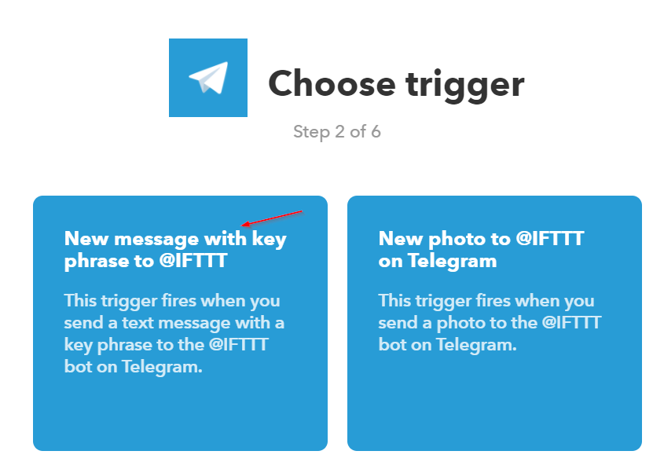

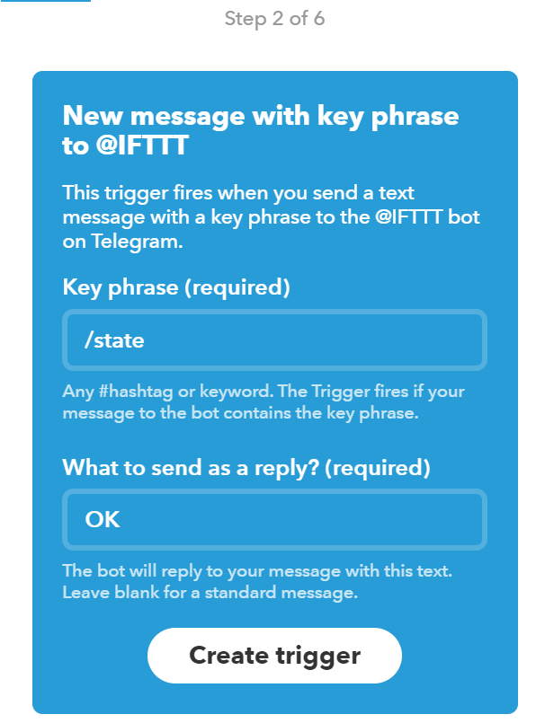

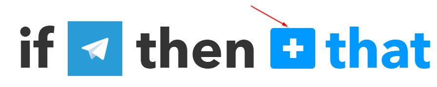

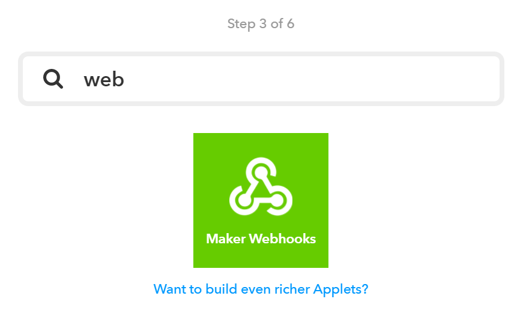

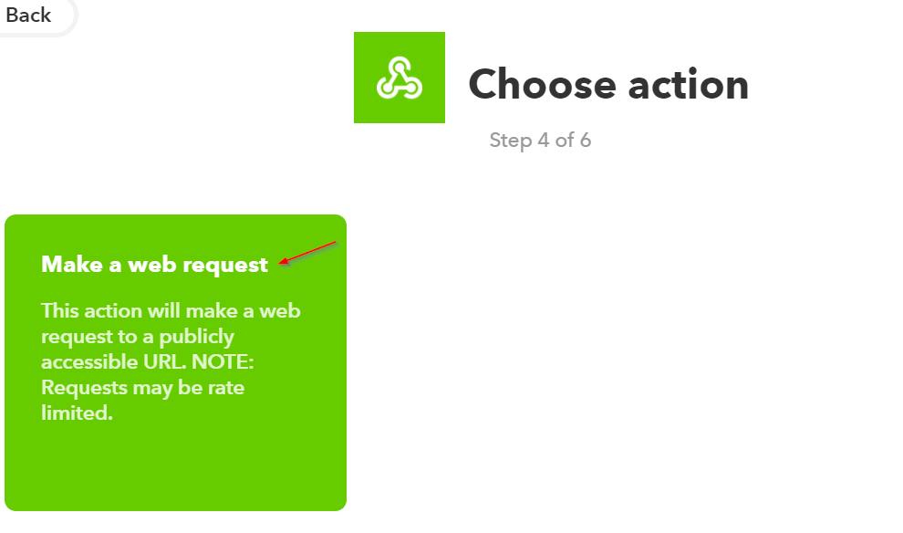

### Get the generated link
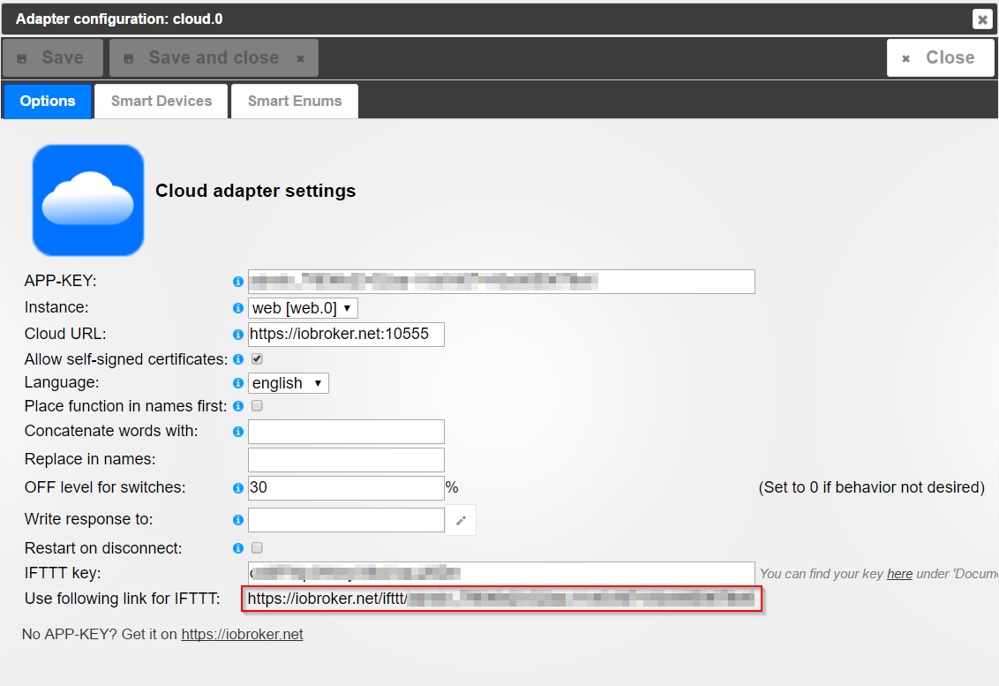

### And paste it into dialog
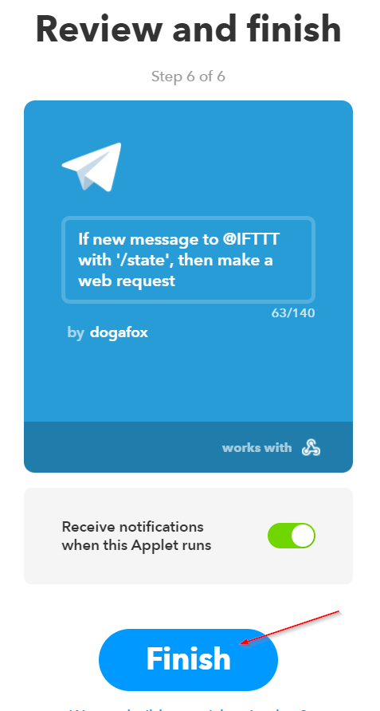


