## Using tasker to send coordinates to ioBroker

### Install tasker

Install tasker on your android phone from here: https://play.google.com/store/apps/details?id=net.dinglisch.android.taskerm

### Configure tasker

#### Create task

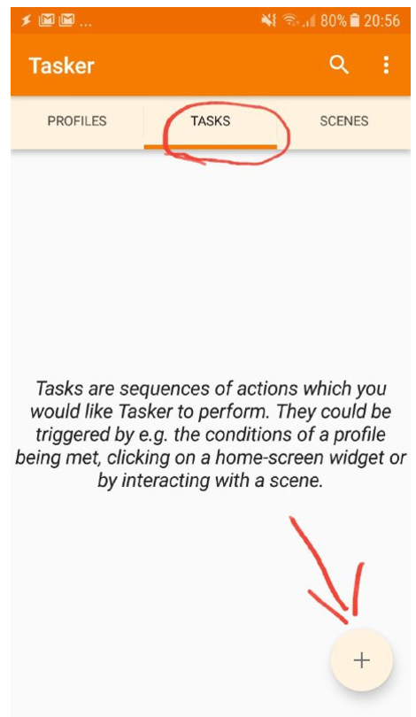

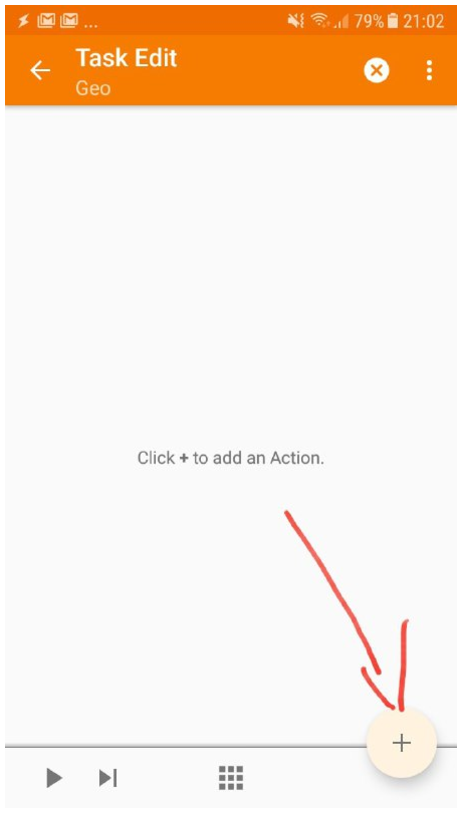

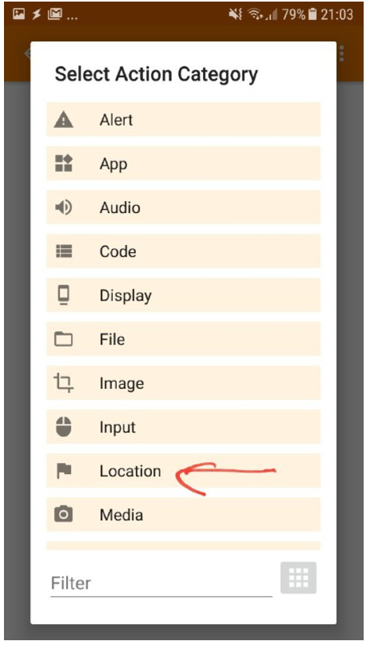


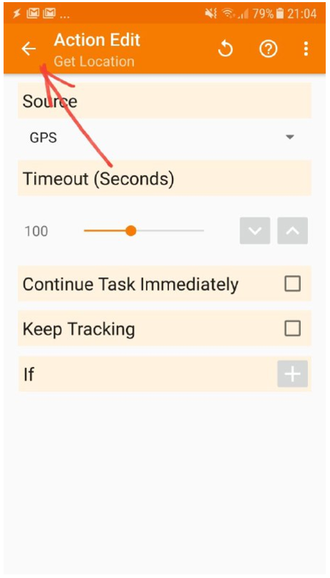

The default settings are ok. Leave it unchanged.

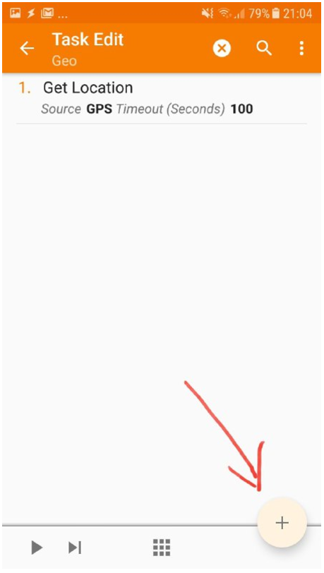

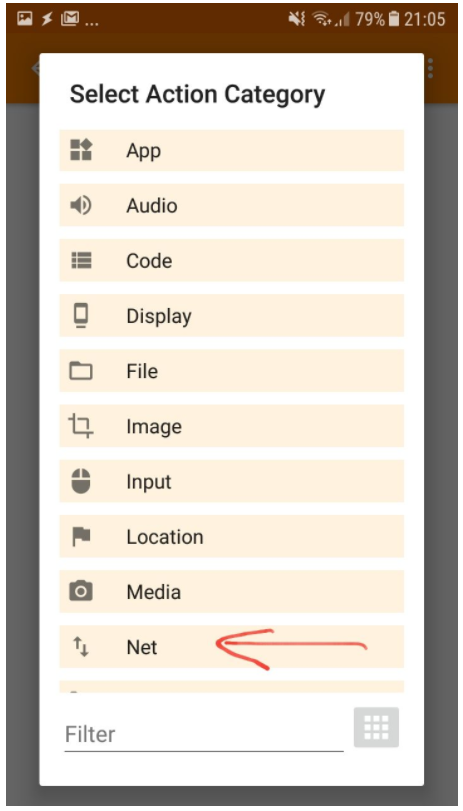

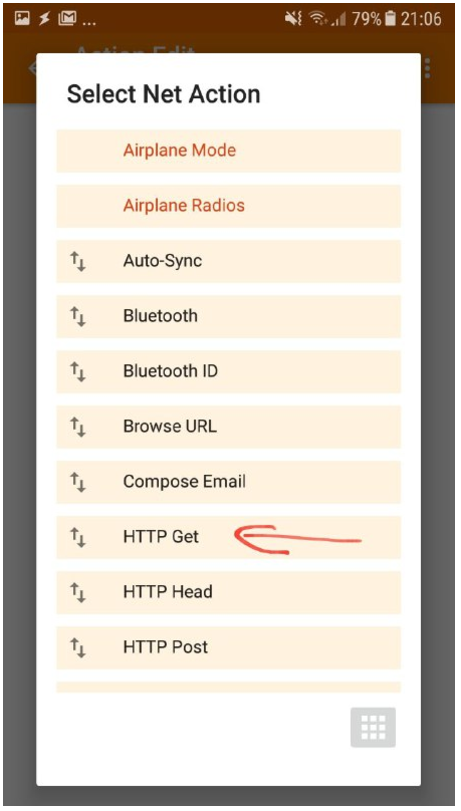

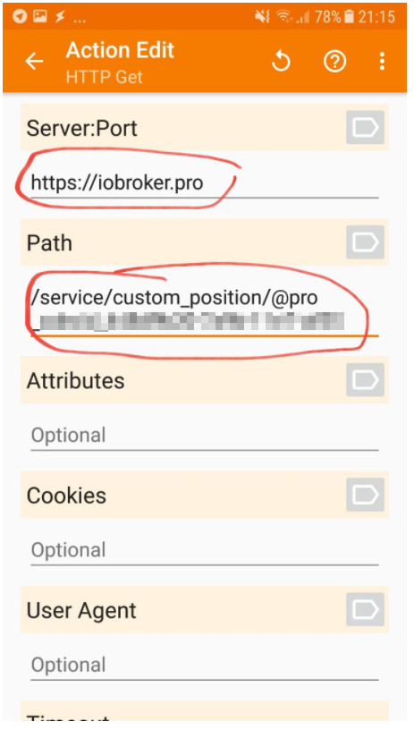

Write into **server:port** ```https://iobroker.pro``` or ```https://iobroker.net```

Write into **path**  ```/service/custom_position/<app-key>/%LOC``` . You can get the link in the settings of the cloud instance.

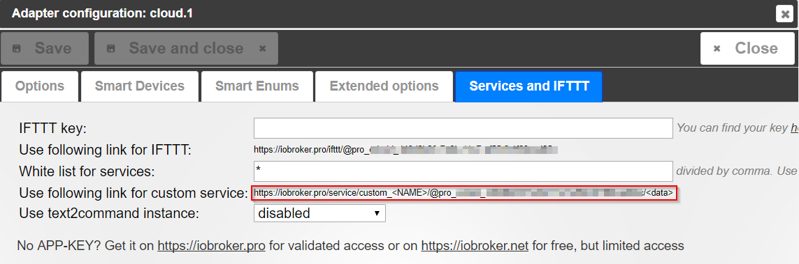

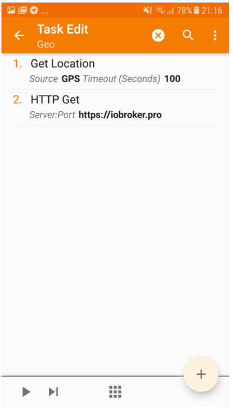

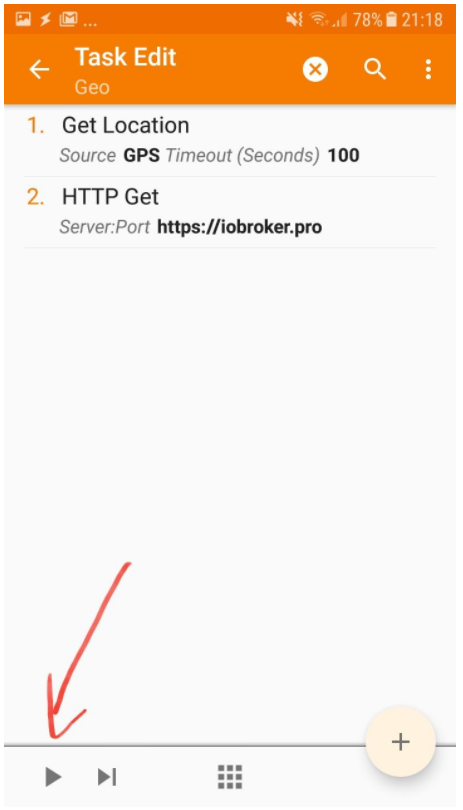

After the task is created, test it and the position must appear in admin.

#### Create profile

Run task every 10 minutes.

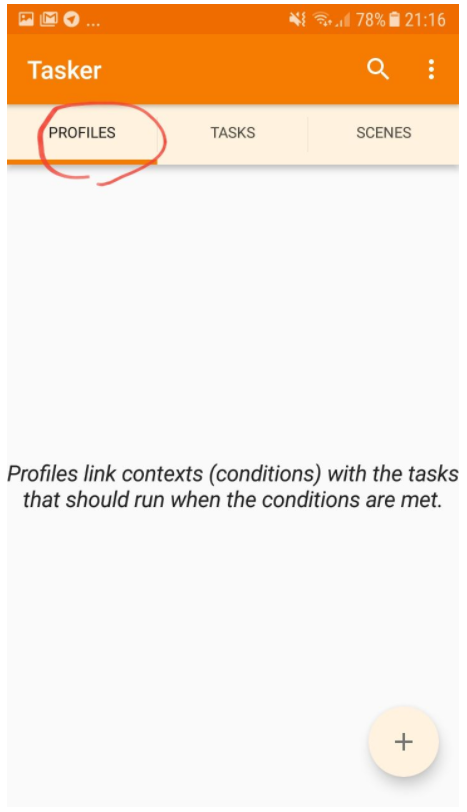

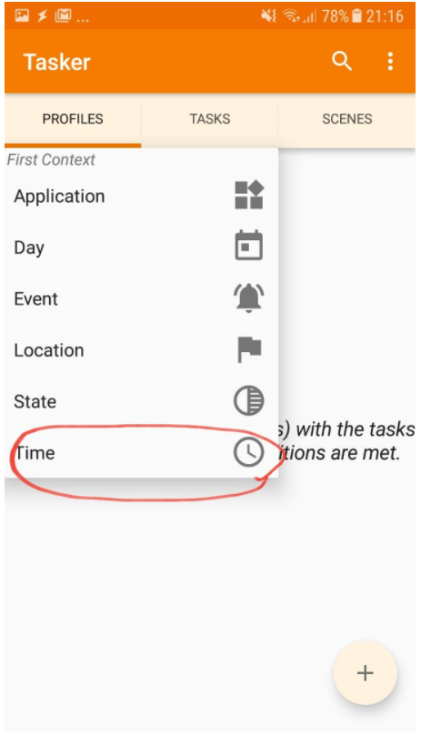

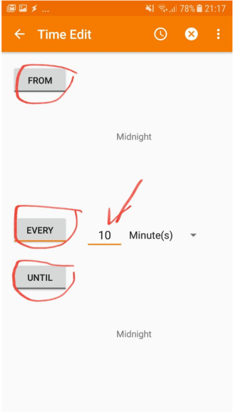

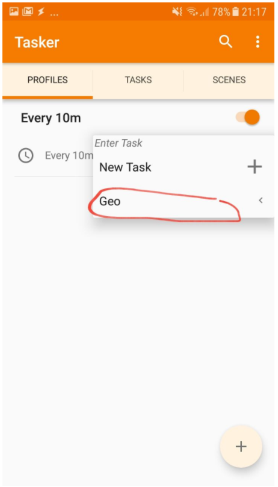

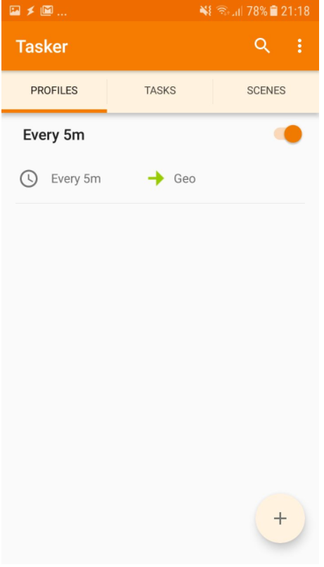

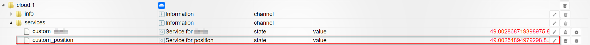

Check the output.

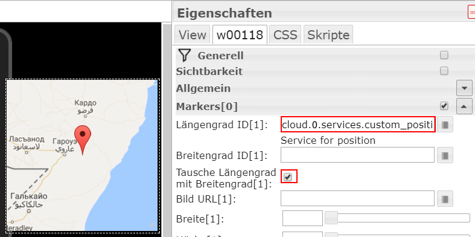

You can use the coordinates in map widget. Just do not forget to swap the longitude and latitude.